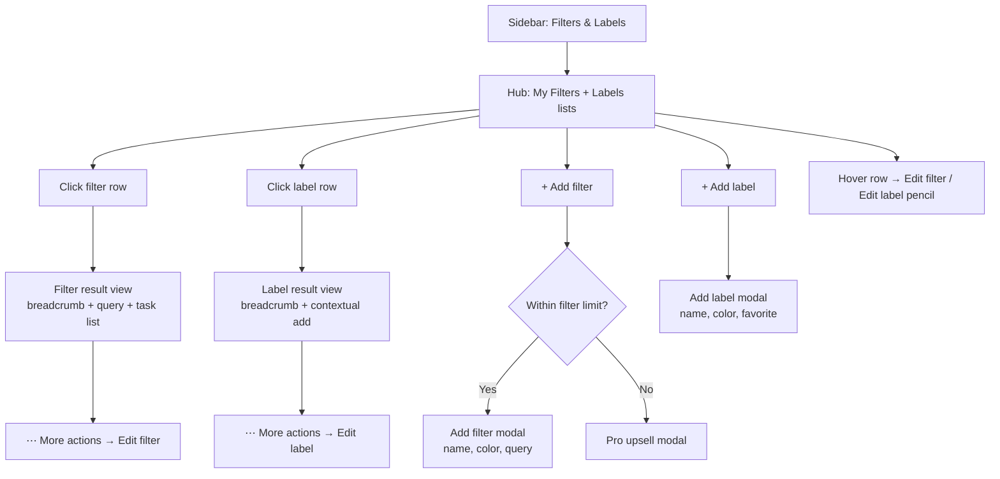

# Todoist — filters & labels flow map

**Last verified:** 2026-06-06 · **Start URL:** `https://app.todoist.com/app/filters-labels`

## Flow overview

## Screens

| Step | State | Entry | What user sees |
|------|-------|-------|----------------|
| 1 | `main` | Sidebar → Filters & Labels | Collapsible **My Filters** and **Labels** sections; usage badges (`USED: 8/3`); task counts per row; gear + add icons |
| 2 | `filter-view` | Click any filter (e.g. Priority 1) | Breadcrumb `Filters & Labels / My Filters /`; filter name + **query string** under title; standard task list with Display menu |
| 3 | `label-view` | Click any label (e.g. Work) | Breadcrumb `Filters & Labels /`; label name; **+ Add task** auto-applies label; empty-state coaching illustration |
| 4 | `create-label` | + next to Labels | Modal: Name (0/60), Color dropdown, Add to favorites toggle, Cancel / Add |
| 5 | `plan-gate` | + filter when over limit, or "Unlock more filters" | Pro trial upsell — highlights **150 filter views** on Pro |

## Secondary paths (not captured)

- **Edit filter:** Open filter → ⋯ → Edit filter, or hover hub row → pencil. Modal mirrors create: name, color, query, favorite.
- **Edit label:** Hub row hover → pencil, or label view ⋯ → Edit label. Modal: rename, color, favorite, delete.
- **Apply label at create:** Quick-add `@label` token or Labels chip in task composer ([quick add](https://www.todoist.com/help/articles/use-task-quick-add-2BvSXFKn)).
- **Shared labels:** Gray labels from collaborators; can move to personal labels ([labels help](https://www.todoist.com/help/articles/introduction-to-labels-dSo2eE)).
